UML Diagram for Java Design Pattern Examples
===

This project lists UML diagrams of the "[Design Pattern Examples in Java](https://github.com/takaakit/design-pattern-examples-in-java)". When you click on a diagram image below, the diagram will be opened in <b>Diagram Map</b>. If you want to know about <b>Diagram Map</b>, please see [this page](https://sites.google.com/view/m-plus-plugin/usage#h.p_Auh2A9HMlSSM).

Diagrams
---

### Behavioral Patterns
| | | |
| :---: | :---: | :---: |
| <b>Chain of Responsibility</b> <a href="https://htmlpreview.github.io/?https://github.com/takaakit/uml-diagram-for-java-design-pattern-examples/blob/master/behavioralpatterns/chainofresponsibility/DiagramMap.html" target="_blank" rel="noopener noreferrer">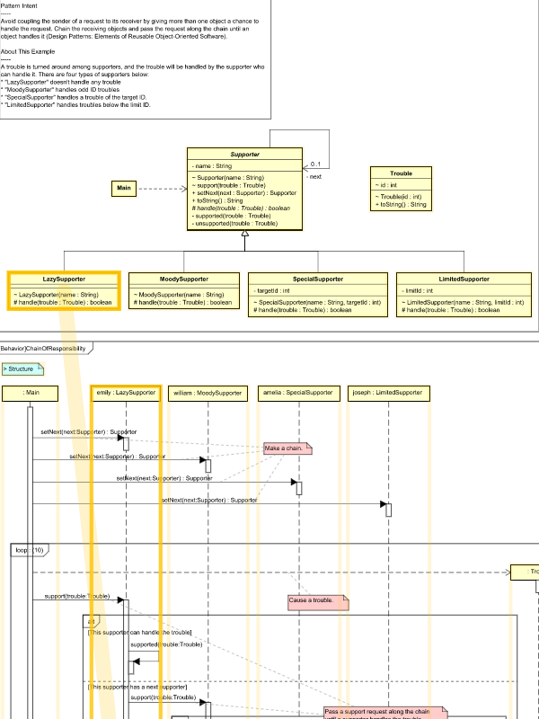</a> <a href="./behavioralpatterns/chainofresponsibility/DiagramMap.svg" target="_blank" rel="noopener noreferrer">SVG Image</a> <a href="https://github.com/takaakit/design-pattern-examples-in-java/tree/master/src/main/java/behavioralpatterns/chainofresponsibility" target="_blank" rel="noopener noreferrer">Java Code</a> | <b>Command</b> <a href="https://htmlpreview.github.io/?https://github.com/takaakit/uml-diagram-for-java-design-pattern-examples/blob/master/behavioralpatterns/command/DiagramMap.html" target="_blank" rel="noopener noreferrer">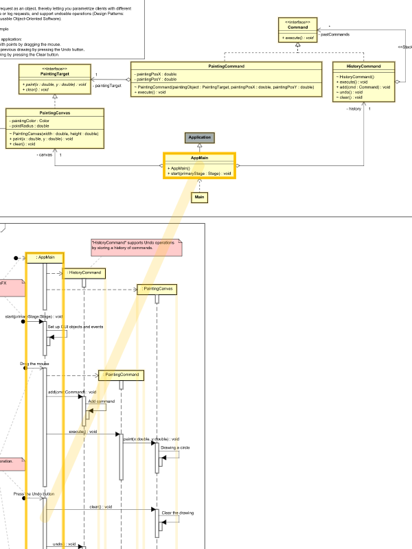</a> <a href="./behavioralpatterns/command/DiagramMap.svg" target="_blank" rel="noopener noreferrer">SVG Image</a> <a href="https://github.com/takaakit/design-pattern-examples-in-java/tree/master/src/main/java/behavioralpatterns/command" target="_blank" rel="noopener noreferrer">Java Code</a> | <b>Interpreter</b> <a href="https://htmlpreview.github.io/?https://github.com/takaakit/uml-diagram-for-java-design-pattern-examples/blob/master/behavioralpatterns/interpreter/DiagramMap.html" target="_blank" rel="noopener noreferrer">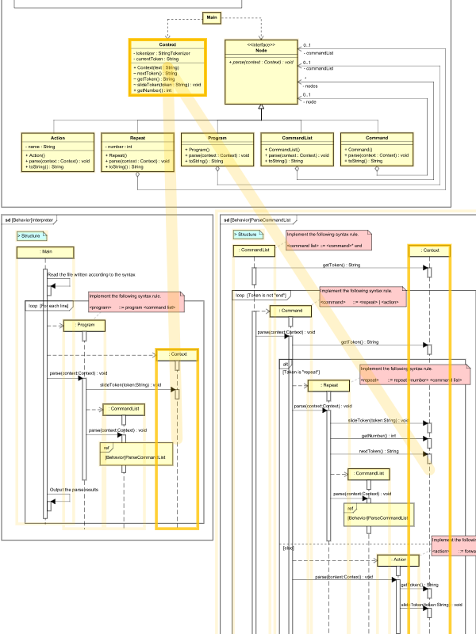</a> <a href="./behavioralpatterns/interpreter/DiagramMap.svg" target="_blank" rel="noopener noreferrer">SVG Image</a> <a href="https://github.com/takaakit/design-pattern-examples-in-java/tree/master/src/main/java/behavioralpatterns/interpreter" target="_blank" rel="noopener noreferrer">Java Code</a> |
| <b>Iterator</b> <a href="https://htmlpreview.github.io/?https://github.com/takaakit/uml-diagram-for-java-design-pattern-examples/blob/master/behavioralpatterns/iterator/DiagramMap.html" target="_blank" rel="noopener noreferrer">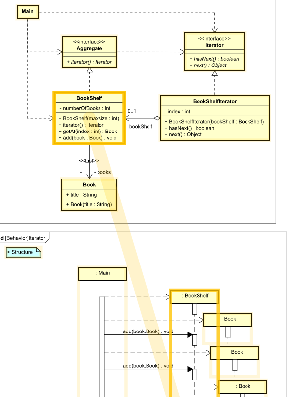</a> <a href="./behavioralpatterns/iterator/DiagramMap.svg" target="_blank" rel="noopener noreferrer">SVG Image</a> <a href="https://github.com/takaakit/design-pattern-examples-in-java/tree/master/src/main/java/behavioralpatterns/iterator" target="_blank" rel="noopener noreferrer">Java Code</a> | <b>Mediator</b> <a href="https://htmlpreview.github.io/?https://github.com/takaakit/uml-diagram-for-java-design-pattern-examples/blob/master/behavioralpatterns/mediator/DiagramMap.html" target="_blank" rel="noopener noreferrer">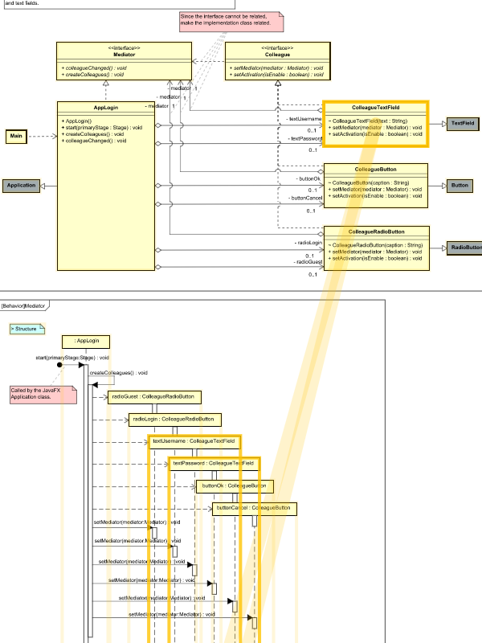</a> <a href="./behavioralpatterns/mediator/DiagramMap.svg">SVG Image</a> <a href="https://github.com/takaakit/design-pattern-examples-in-java/tree/master/src/main/java/behavioralpatterns/mediator" target="_blank" rel="noopener noreferrer">Java Code</a> | <b>Memento</b> <a href="https://htmlpreview.github.io/?https://github.com/takaakit/uml-diagram-for-java-design-pattern-examples/blob/master/behavioralpatterns/memento/DiagramMap.html" target="_blank" rel="noopener noreferrer">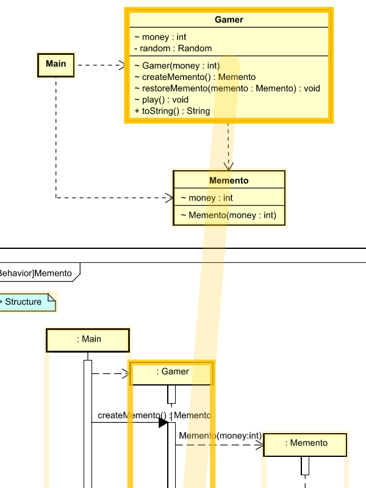</a> <a href="./behavioralpatterns/memento/DiagramMap.svg" target="_blank" rel="noopener noreferrer">SVG Image</a> <a href="https://github.com/takaakit/design-pattern-examples-in-java/tree/master/src/main/java/behavioralpatterns/memento" target="_blank" rel="noopener noreferrer">Java Code</a> |
| <b>Observer</b> <a href="https://htmlpreview.github.io/?https://github.com/takaakit/uml-diagram-for-java-design-pattern-examples/blob/master/behavioralpatterns/observer/DiagramMap.html" target="_blank" rel="noopener noreferrer">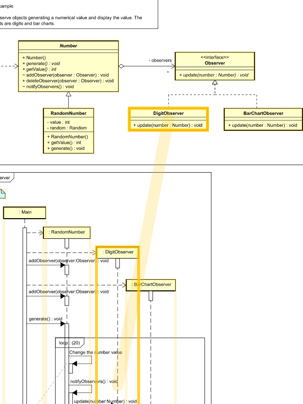</a> <a href="./behavioralpatterns/observer/DiagramMap.svg" target="_blank" rel="noopener noreferrer">SVG Image</a> <a href="https://github.com/takaakit/design-pattern-examples-in-java/tree/master/src/main/java/behavioralpatterns/observer" target="_blank" rel="noopener noreferrer">Java Code</a> | <b>State</b> <a href="https://htmlpreview.github.io/?https://github.com/takaakit/uml-diagram-for-java-design-pattern-examples/blob/master/behavioralpatterns/state/DiagramMap.html" target="_blank" rel="noopener noreferrer">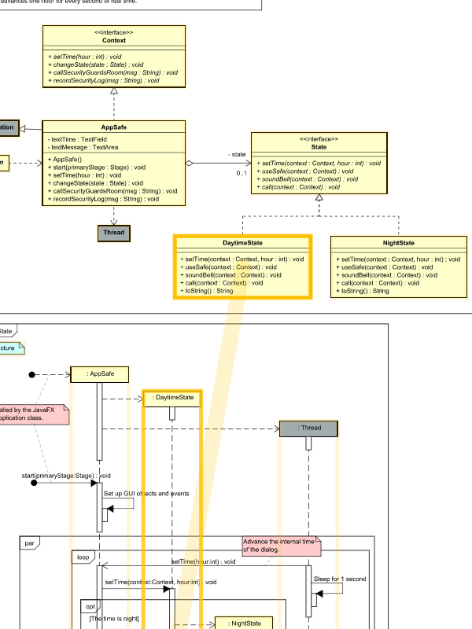</a> <a href="./behavioralpatterns/state/DiagramMap.svg" target="_blank" rel="noopener noreferrer">SVG Image</a> <a href="https://github.com/takaakit/design-pattern-examples-in-java/tree/master/src/main/java/behavioralpatterns/state" target="_blank" rel="noopener noreferrer">Java Code</a> | <b>Strategy</b> <a href="https://htmlpreview.github.io/?https://github.com/takaakit/uml-diagram-for-java-design-pattern-examples/blob/master/behavioralpatterns/strategy/DiagramMap.html" target="_blank" rel="noopener noreferrer">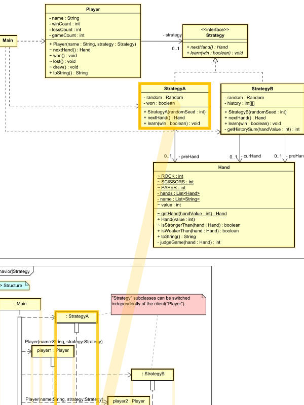</a> <a href="./behavioralpatterns/strategy/DiagramMap.svg" target="_blank" rel="noopener noreferrer">SVG Image</a> <a href="https://github.com/takaakit/design-pattern-examples-in-java/tree/master/src/main/java/behavioralpatterns/strategy" target="_blank" rel="noopener noreferrer">Java Code</a> |
| <b>Template Method</b> <a href="https://htmlpreview.github.io/?https://github.com/takaakit/uml-diagram-for-java-design-pattern-examples/blob/master/behavioralpatterns/templatemethod/DiagramMap.html" target="_blank" rel="noopener noreferrer">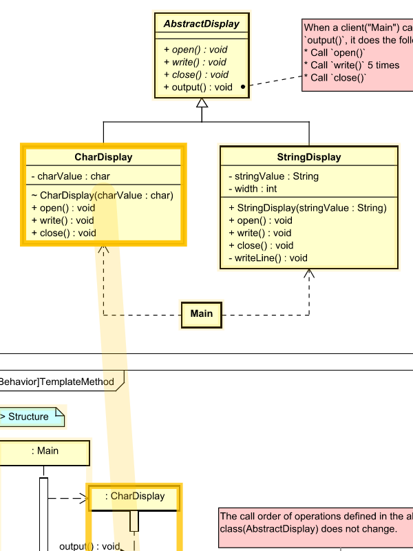</a> <a href="./behavioralpatterns/templatemethod/DiagramMap.svg" target="_blank" rel="noopener noreferrer">SVG Image</a> <a href="https://github.com/takaakit/design-pattern-examples-in-java/tree/master/src/main/java/behavioralpatterns/templatemethod" target="_blank" rel="noopener noreferrer">Java Code</a> | <b>Visitor</b> <a href="https://htmlpreview.github.io/?https://github.com/takaakit/uml-diagram-for-java-design-pattern-examples/blob/master/behavioralpatterns/visitor/DiagramMap.html" target="_blank" rel="noopener noreferrer">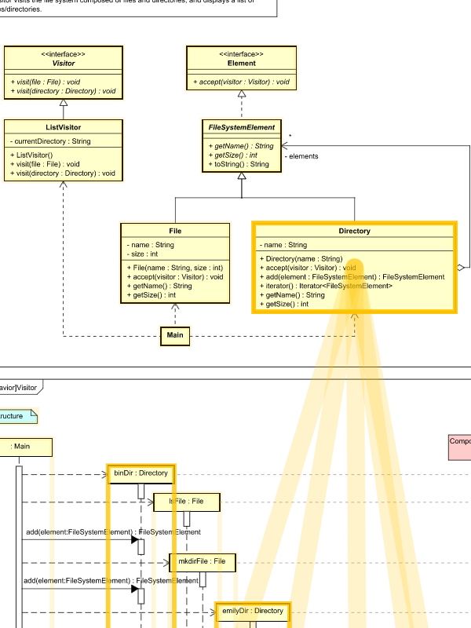</a> <a href="./behavioralpatterns/visitor/DiagramMap.svg" target="_blank" rel="noopener noreferrer">SVG Image</a> <a href="https://github.com/takaakit/design-pattern-examples-in-java/tree/master/src/main/java/behavioralpatterns/visitor" target="_blank" rel="noopener noreferrer">Java Code</a> | |

### Creational Patterns
| | | |
| :---: | :---: | :---: |
| <b>Abstract Factory</b> <a href="https://htmlpreview.github.io/?https://github.com/takaakit/uml-diagram-for-java-design-pattern-examples/blob/master/creationalpatterns/abstractfactory/DiagramMap.html" target="_blank" rel="noopener noreferrer">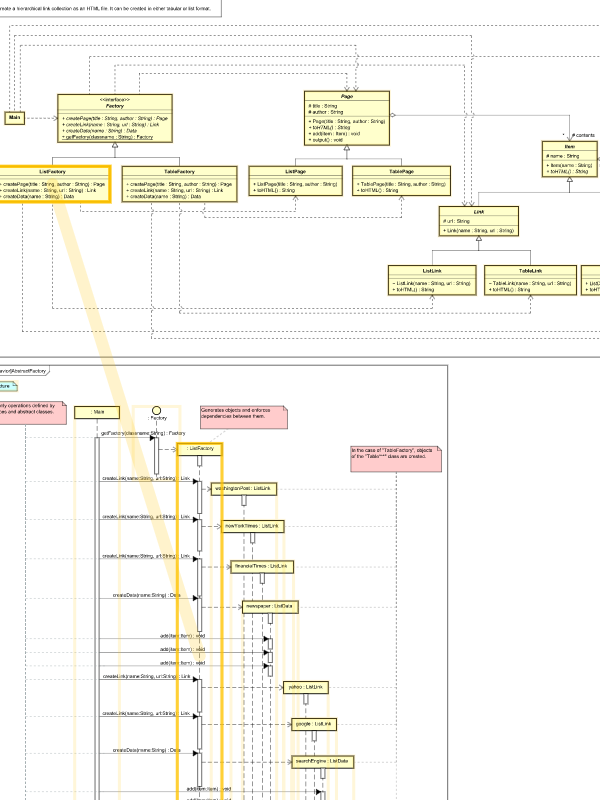</a> <a href="./creationalpatterns/abstractfactory/DiagramMap.svg" target="_blank" rel="noopener noreferrer">SVG Image</a> <a href="https://github.com/takaakit/design-pattern-examples-in-java/tree/master/src/main/java/creationalpatterns/abstractfactory" target="_blank" rel="noopener noreferrer">Java Code</a> | <b>Builder</b> <a href="https://htmlpreview.github.io/?https://github.com/takaakit/uml-diagram-for-java-design-pattern-examples/blob/master/creationalpatterns/builder/DiagramMap.html" target="_blank" rel="noopener noreferrer">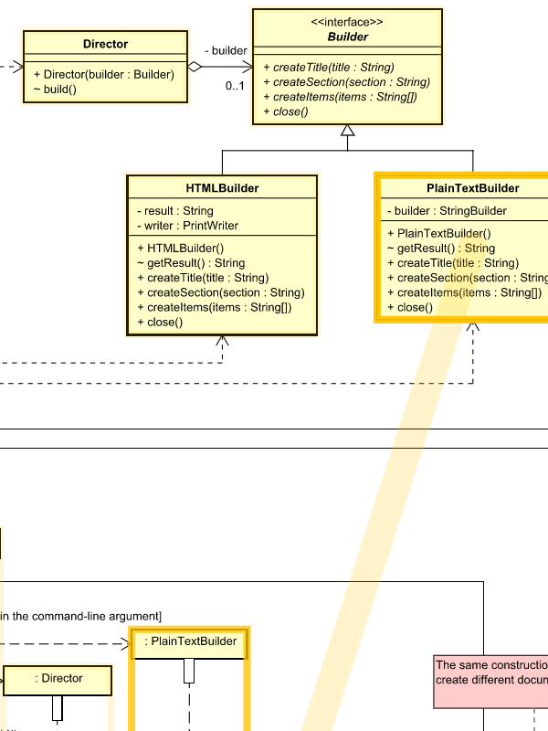</a> <a href="./creationalpatterns/builder/DiagramMap.svg" target="_blank" rel="noopener noreferrer">SVG Image</a> <a href="https://github.com/takaakit/design-pattern-examples-in-java/tree/master/src/main/java/creationalpatterns/builder" target="_blank" rel="noopener noreferrer">Java Code</a> | <b>Factory Method</b> <a href="https://htmlpreview.github.io/?https://github.com/takaakit/uml-diagram-for-java-design-pattern-examples/blob/master/creationalpatterns/factorymethod/DiagramMap.html" target="_blank" rel="noopener noreferrer">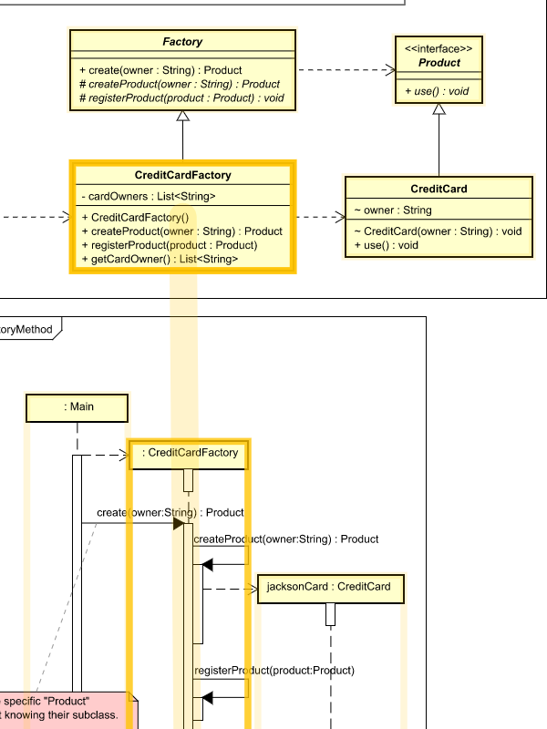</a> <a href="./creationalpatterns/factorymethod/DiagramMap.svg" target="_blank" rel="noopener noreferrer">SVG Image</a> <a href="https://github.com/takaakit/design-pattern-examples-in-java/tree/master/src/main/java/creationalpatterns/factorymethod" target="_blank" rel="noopener noreferrer">Java Code</a> |
| <b>Prototype</b> <a href="https://htmlpreview.github.io/?https://github.com/takaakit/uml-diagram-for-java-design-pattern-examples/blob/master/creationalpatterns/prototype/DiagramMap.html" target="_blank" rel="noopener noreferrer">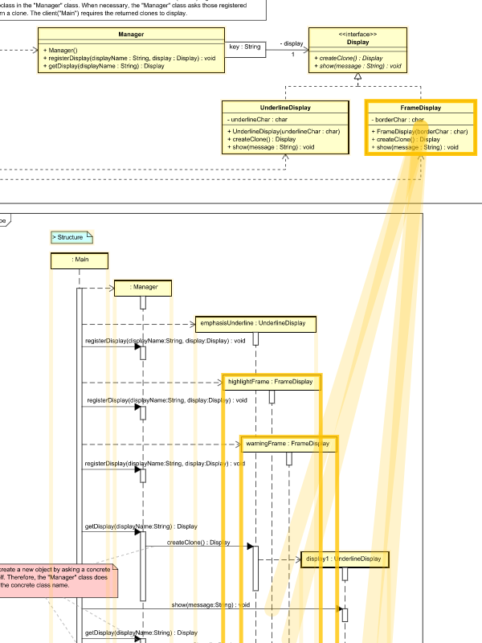</a> <a href="./creationalpatterns/prototype/DiagramMap.svg" target="_blank" rel="noopener noreferrer">SVG Image</a> <a href="https://github.com/takaakit/design-pattern-examples-in-java/tree/master/src/main/java/creationalpatterns/prototype" target="_blank" rel="noopener noreferrer">Java Code</a> | <b>Singleton</b> <a href="https://htmlpreview.github.io/?https://github.com/takaakit/uml-diagram-for-java-design-pattern-examples/blob/master/creationalpatterns/singleton/DiagramMap.html" target="_blank" rel="noopener noreferrer">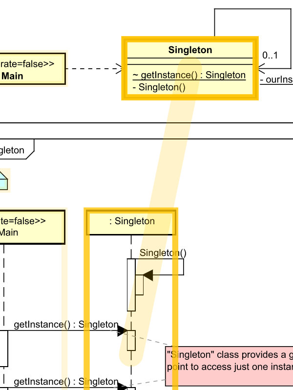</a> <a href="./creationalpatterns/singleton/DiagramMap.svg" target="_blank" rel="noopener noreferrer">SVG Image</a> <a href="https://github.com/takaakit/design-pattern-examples-in-java/tree/master/src/main/java/creationalpatterns/singleton" target="_blank" rel="noopener noreferrer">Java Code</a> | |

### Creational Patterns
| | | |
| :---: | :---: | :---: |
| <b>Adapter</b> <a href="https://htmlpreview.github.io/?https://github.com/takaakit/uml-diagram-for-java-design-pattern-examples/blob/master/structuralpatterns/adapter/DiagramMap.html" target="_blank" rel="noopener noreferrer">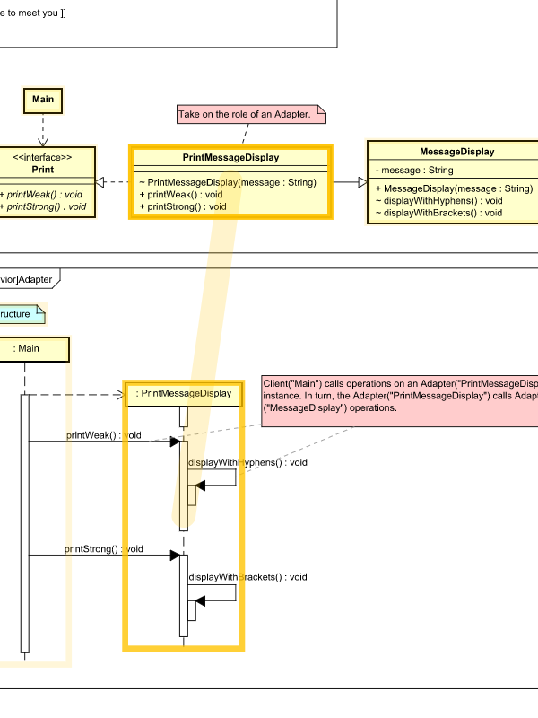</a> <a href="./structuralpatterns/adapter/DiagramMap.svg" target="_blank" rel="noopener noreferrer">SVG Image</a> <a href="https://github.com/takaakit/design-pattern-examples-in-java/tree/master/src/main/java/structuralpatterns/adapter" target="_blank" rel="noopener noreferrer">Java Code</a> | <b>Bridge</b> <a href="https://htmlpreview.github.io/?https://github.com/takaakit/uml-diagram-for-java-design-pattern-examples/blob/master/structuralpatterns/bridge/DiagramMap.html" target="_blank" rel="noopener noreferrer">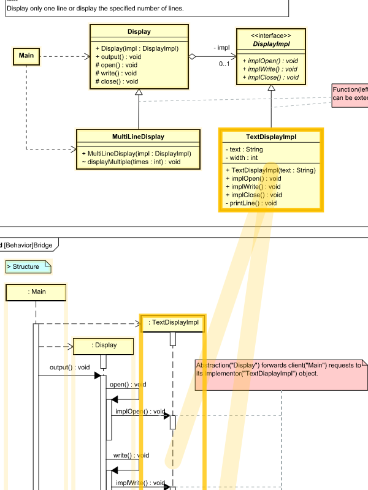</a> <a href="./structuralpatterns/bridge/DiagramMap.svg" target="_blank" rel="noopener noreferrer">SVG Image</a> <a href="https://github.com/takaakit/design-pattern-examples-in-java/tree/master/src/main/java/structuralpatterns/bridge" target="_blank" rel="noopener noreferrer">Java Code</a> | <b>Composite</b> <a href="https://htmlpreview.github.io/?https://github.com/takaakit/uml-diagram-for-java-design-pattern-examples/blob/master/structuralpatterns/composite/DiagramMap.html" target="_blank" rel="noopener noreferrer">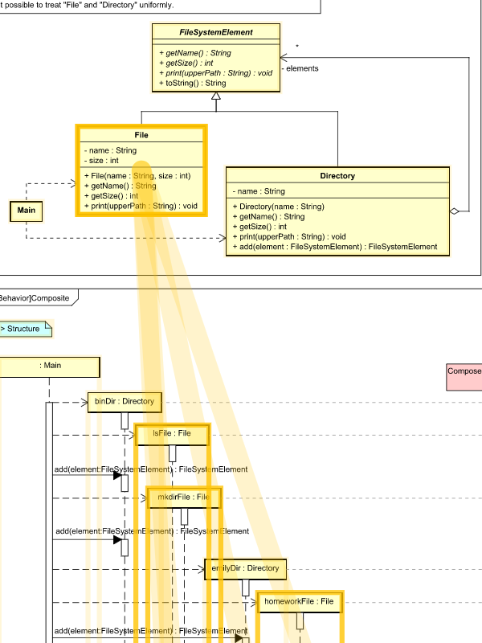</a> <a href="./structuralpatterns/composite/DiagramMap.svg" target="_blank" rel="noopener noreferrer">SVG Image</a> <a href="https://github.com/takaakit/design-pattern-examples-in-java/tree/master/src/main/java/structuralpatterns/composite" target="_blank" rel="noopener noreferrer">Java Code</a> |
| <b>Decorator</b> <a href="https://htmlpreview.github.io/?https://github.com/takaakit/uml-diagram-for-java-design-pattern-examples/blob/master/structuralpatterns/decorator/DiagramMap.html" target="_blank" rel="noopener noreferrer">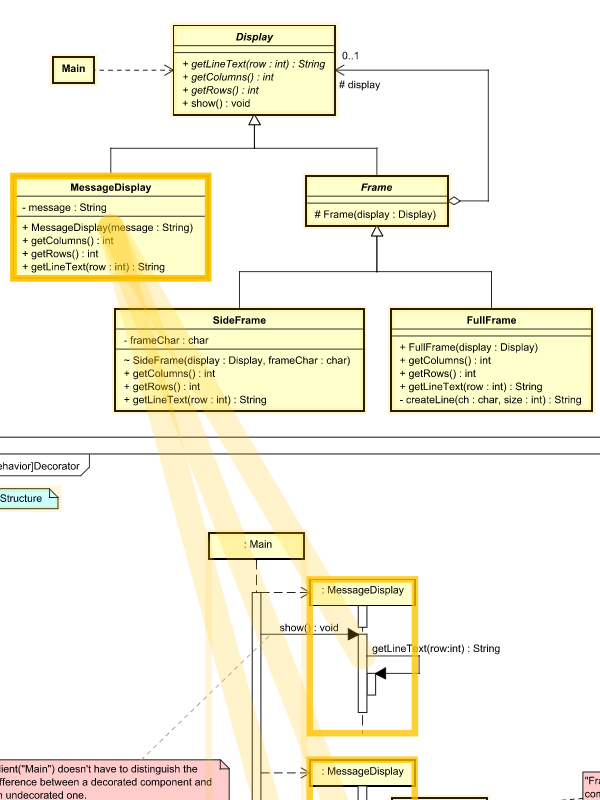</a> <a href="./structuralpatterns/decorator/DiagramMap.svg" target="_blank" rel="noopener noreferrer">SVG Image</a> <a href="https://github.com/takaakit/design-pattern-examples-in-java/tree/master/src/main/java/structuralpatterns/decorator" target="_blank" rel="noopener noreferrer">Java Code</a> | <b>Facade</b> <a href="https://htmlpreview.github.io/?https://github.com/takaakit/uml-diagram-for-java-design-pattern-examples/blob/master/structuralpatterns/facade/DiagramMap.html" target="_blank" rel="noopener noreferrer">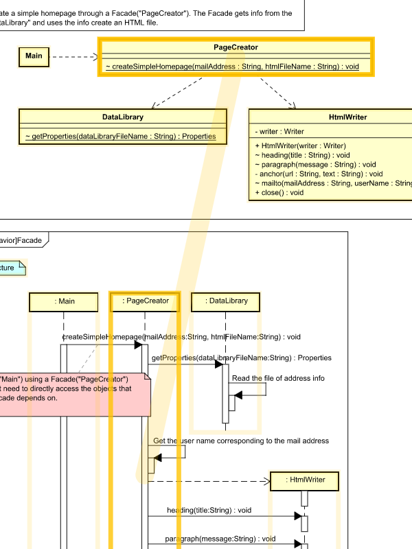</a> <a href="./structuralpatterns/facade/DiagramMap.svg" target="_blank" rel="noopener noreferrer">SVG Image</a> <a href="https://github.com/takaakit/design-pattern-examples-in-java/tree/master/src/main/java/structuralpatterns/facade" target="_blank" rel="noopener noreferrer">Java Code</a> | <b>Flyweight</b> <a href="https://htmlpreview.github.io/?https://github.com/takaakit/uml-diagram-for-java-design-pattern-examples/blob/master/structuralpatterns/flyweight/DiagramMap.html" target="_blank" rel="noopener noreferrer">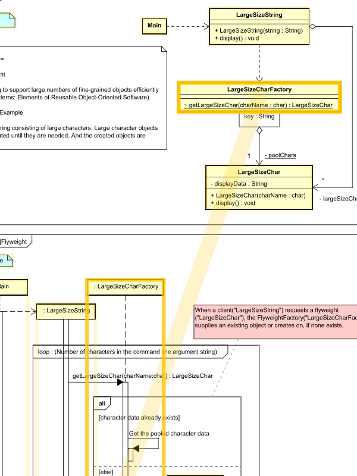</a> <a href="./structuralpatterns/flyweight/DiagramMap.svg" target="_blank" rel="noopener noreferrer">SVG Image</a> <a href="https://github.com/takaakit/design-pattern-examples-in-java/tree/master/src/main/java/structuralpatterns/flyweight" target="_blank" rel="noopener noreferrer">Java Code</a> |
| <b>Proxy</b> <a href="https://htmlpreview.github.io/?https://github.com/takaakit/uml-diagram-for-java-design-pattern-examples/blob/master/structuralpatterns/proxy/DiagramMap.html" target="_blank" rel="noopener noreferrer">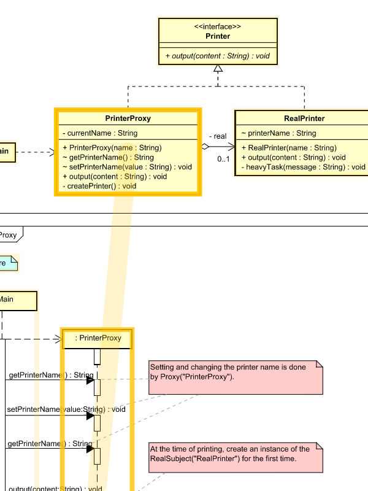</a> <a href="./structuralpatterns/proxy/DiagramMap.svg" target="_blank" rel="noopener noreferrer">SVG Image</a> <a href="https://github.com/takaakit/design-pattern-examples-in-java/tree/master/src/main/java/structuralpatterns/proxy" target="_blank" rel="noopener noreferrer">Java Code</a> | | |

References
---
* Gamma, E. et al. Design Patterns: Elements of Reusable Object-Oriented Software, Addison-Wesley, 1994
* Hiroshi Yuki. Learning Design Patterns in Java [In Japanese Language], Softbank publishing, 2004

Links
---
* [Design Pattern Examples in Java](https://github.com/takaakit/design-pattern-examples-in-java)
* [Diagram Map](https://sites.google.com/view/m-plus-plugin/usage#h.p_Auh2A9HMlSSM)

Licence
---
Diagram Map file (DiagramMap.html) includes the following libraries:
* [D3 library](https://d3js.org) is copyrighted by Mike Bostock and is released under the [BSD license](https://opensource.org/licenses/BSD-3-Clause).
* [Popper library](https://popper.js.org/) is copyrighted by Federico Zivolo and is released under the [MIT license](https://opensource.org/licenses/MIT).
* [Tippy library](https://atomiks.github.io/tippyjs/) is copyrighted by atomiks and is released under the [MIT license](https://opensource.org/licenses/MIT).

Files and data in this project other than the above libraries are under the [Creative Commons Zero (CC0) license](https://creativecommons.org/publicdomain/zero/1.0/).
