UML Diagram for Java Design Pattern Examples
===

This project lists UML diagrams of the "[Design Pattern Examples in Java](https://github.com/takaakit/design-pattern-examples-in-java)". When you click on a diagram image, the diagram will be opened in **Diagram Map**. If you want to know about Diagram Map, see [this post](https://dev.to/takaakit/diagram-map-tracing-uml-sysml-elements-across-diagrams-49i7).

Behavioral Patterns
---
|  |  |  |
| :---: | :---: | :---: |
| **Chain of Responsibility** | **Command** | **Interpreter** |
| <a href="https://takaakit.github.io/uml-diagram-for-java-design-pattern-examples/behavioralpatterns/chainofresponsibility/diagram_map.html">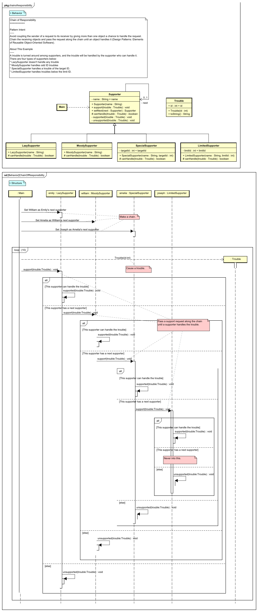</a> <a href="https://github.com/takaakit/design-pattern-examples-in-java/tree/master/src/main/java/behavioralpatterns/chainofresponsibility">Java Code</a> <a href="./behavioralpatterns/chainofresponsibility/execution_result.png">Execution Result</a> |  <a href="https://github.com/takaakit/design-pattern-examples-in-java/tree/master/src/main/java/behavioralpatterns/command">Java Code</a> <a href="./behavioralpatterns/command/execution_result.png">Execution Result</a> |  <a href="https://github.com/takaakit/design-pattern-examples-in-java/tree/master/src/main/java/behavioralpatterns/interpreter">Java Code</a> <a href="./behavioralpatterns/interpreter/execution_result.png">Execution Result</a> |
| **Iterator** | **Mediator** | **Memento** |
|  <a href="https://github.com/takaakit/design-pattern-examples-in-java/tree/master/src/main/java/behavioralpatterns/iterator">Java Code</a> <a href="./behavioralpatterns/iterator/execution_result.png">Execution Result</a> | <a href="https://takaakit.github.io/uml-diagram-for-java-design-pattern-examples/behavioralpatterns/mediator/diagram_map.html">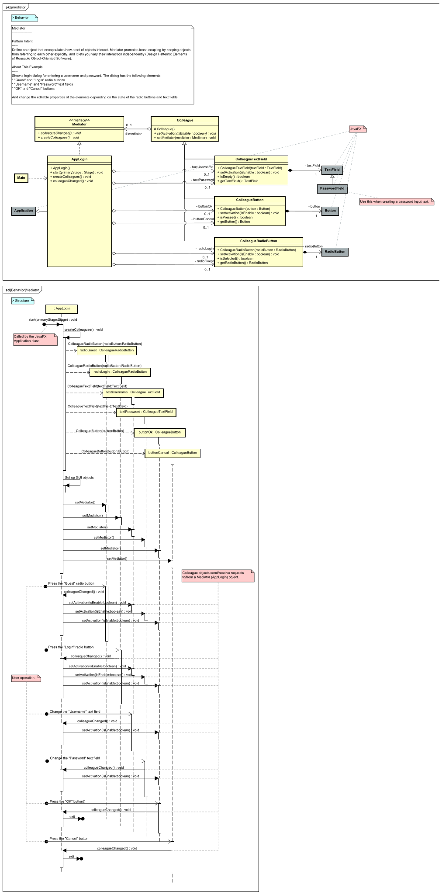</a> <a href="https://github.com/takaakit/design-pattern-examples-in-java/tree/master/src/main/java/behavioralpatterns/mediator">Java Code</a> <a href="./behavioralpatterns/mediator/execution_result.png">Execution Result</a> | <a href="https://takaakit.github.io/uml-diagram-for-java-design-pattern-examples/behavioralpatterns/memento/diagram_map.html">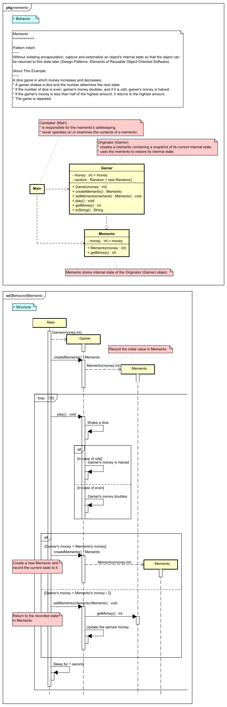</a> <a href="https://github.com/takaakit/design-pattern-examples-in-java/tree/master/src/main/java/behavioralpatterns/memento">Java Code</a> <a href="./behavioralpatterns/memento/execution_result.png">Execution Result</a> |
| **Observer** | **State** | **Strategy** |
| <a href="https://takaakit.github.io/uml-diagram-for-java-design-pattern-examples/behavioralpatterns/observer/diagram_map.html">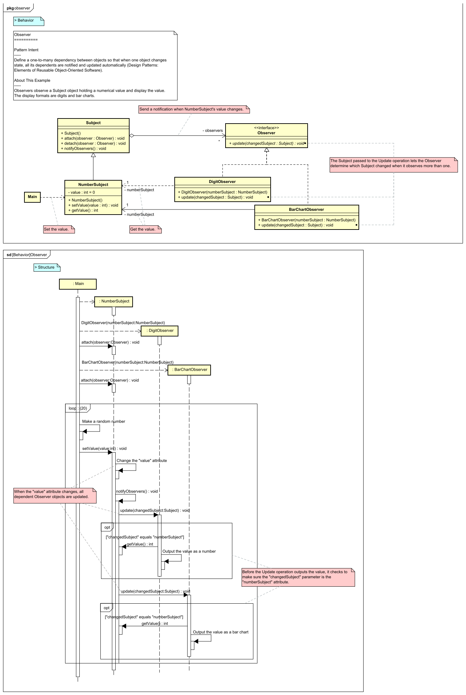</a> <a href="https://github.com/takaakit/design-pattern-examples-in-java/tree/master/src/main/java/behavioralpatterns/observer">Java Code</a> <a href="./behavioralpatterns/observer/execution_result.png">Execution Result</a> | <a href="https://takaakit.github.io/uml-diagram-for-java-design-pattern-examples/behavioralpatterns/state/diagram_map.html">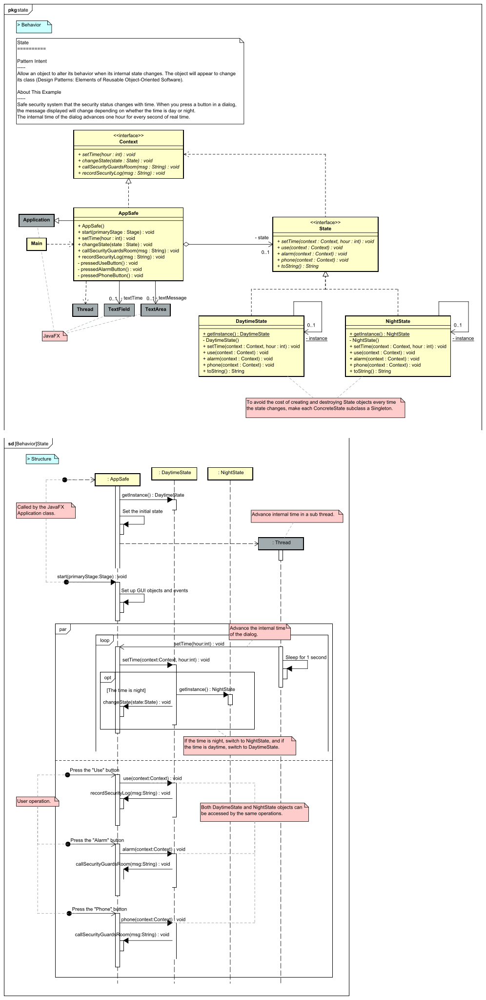</a> <a href="https://github.com/takaakit/design-pattern-examples-in-java/tree/master/src/main/java/behavioralpatterns/state">Java Code</a> <a href="./behavioralpatterns/state/execution_result.png">Execution Result</a> | <a href="https://takaakit.github.io/uml-diagram-for-java-design-pattern-examples/behavioralpatterns/strategy/diagram_map.html">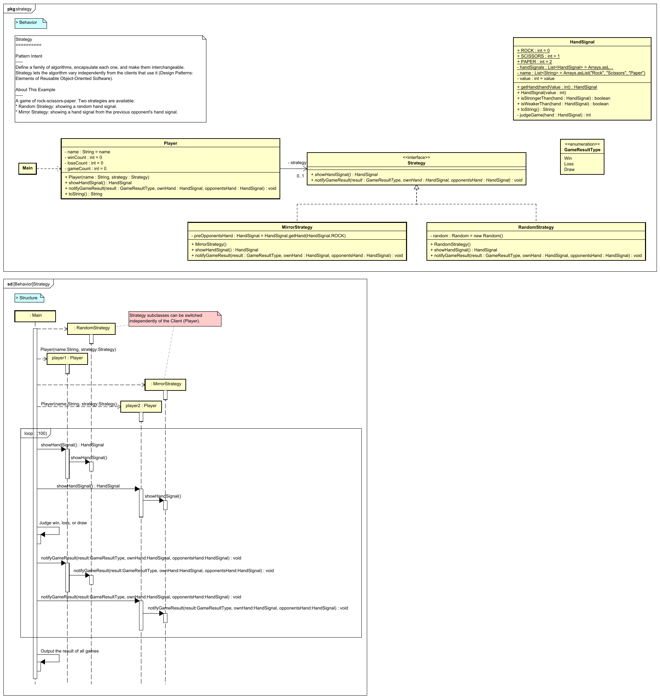</a> <a href="https://github.com/takaakit/design-pattern-examples-in-java/tree/master/src/main/java/behavioralpatterns/strategy">Java Code</a> <a href="./behavioralpatterns/strategy/execution_result.png">Execution Result</a> |
| **Template Method** | **Visitor** |  |
| <a href="https://takaakit.github.io/uml-diagram-for-java-design-pattern-examples/behavioralpatterns/templatemethod/diagram_map.html">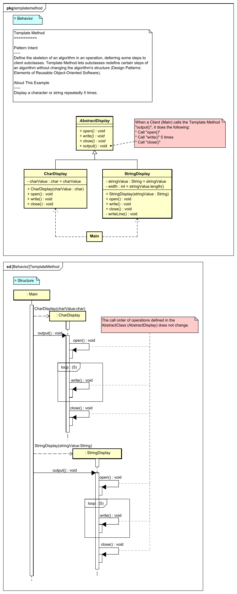</a> <a href="https://github.com/takaakit/design-pattern-examples-in-java/tree/master/src/main/java/behavioralpatterns/templatemethod">Java Code</a> <a href="./behavioralpatterns/templatemethod/execution_result.png">Execution Result</a> | <a href="https://takaakit.github.io/uml-diagram-for-java-design-pattern-examples/behavioralpatterns/visitor/diagram_map.html">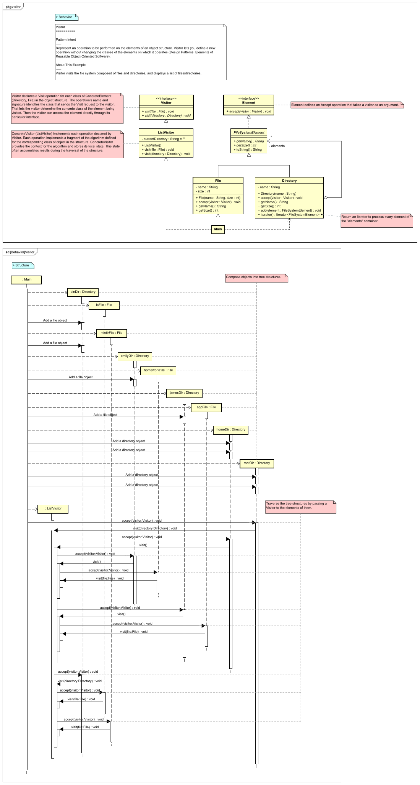</a> <a href="https://github.com/takaakit/design-pattern-examples-in-java/tree/master/src/main/java/behavioralpatterns/visitor">Java Code</a> <a href="./behavioralpatterns/visitor/execution_result.png">Execution Result</a> |  |

Creational Patterns
---
|  |  |  |
| :---: | :---: | :---: |
| **Abstract Factory** | **Builder** | **Factory Method** |
| <a href="https://takaakit.github.io/uml-diagram-for-java-design-pattern-examples/creationalpatterns/abstractfactory/diagram_map.html">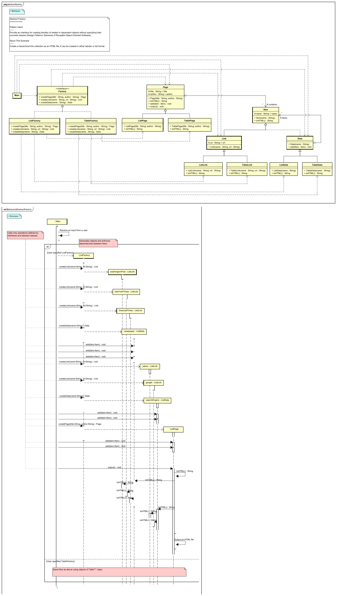</a> <a href="https://github.com/takaakit/design-pattern-examples-in-java/tree/master/src/main/java/creationalpatterns/abstractfactory">Java Code</a> <a href="./creationalpatterns/abstractfactory/execution_result.png">Execution Result</a> | <a href="https://takaakit.github.io/uml-diagram-for-java-design-pattern-examples/creationalpatterns/builder/diagram_map.html">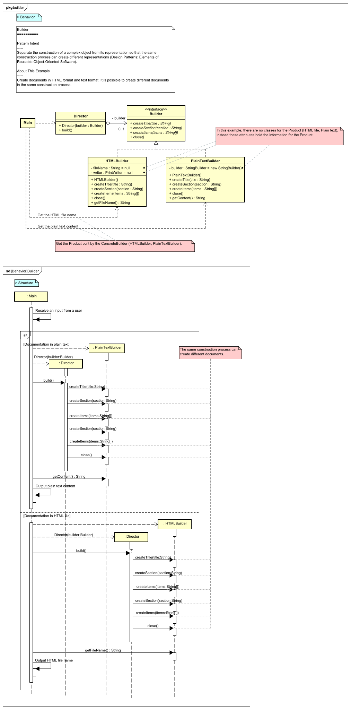</a> <a href="https://github.com/takaakit/design-pattern-examples-in-java/tree/master/src/main/java/creationalpatterns/builder">Java Code</a> <a href="./creationalpatterns/builder/execution_result.png">Execution Result</a> | <a href="https://takaakit.github.io/uml-diagram-for-java-design-pattern-examples/creationalpatterns/factorymethod/diagram_map.html">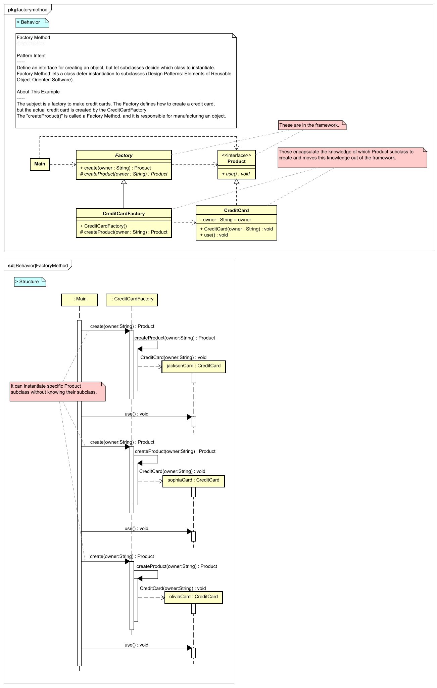</a> <a href="https://github.com/takaakit/design-pattern-examples-in-java/tree/master/src/main/java/creationalpatterns/factorymethod">Java Code</a> <a href="./creationalpatterns/factorymethod/execution_result.png">Execution Result</a> |
| **Prototype** | **Singleton** |  |
| <a href="https://takaakit.github.io/uml-diagram-for-java-design-pattern-examples/creationalpatterns/prototype/diagram_map.html">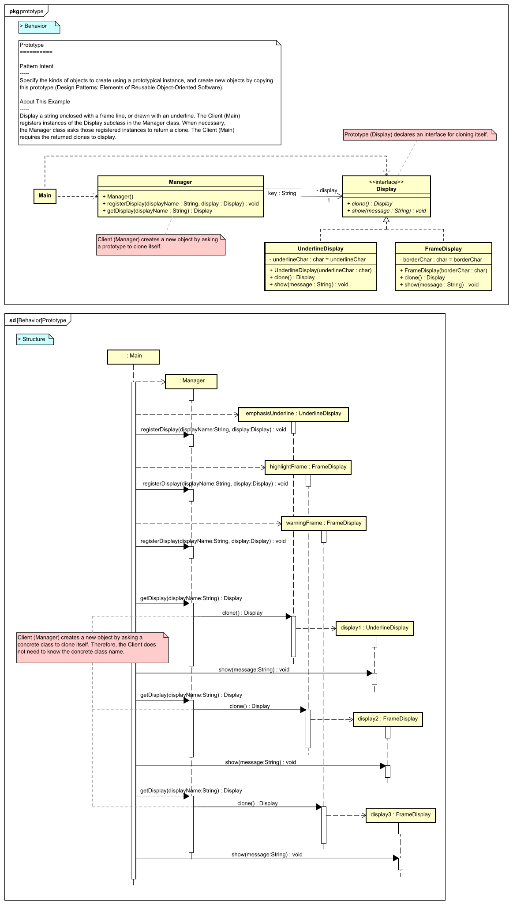</a> <a href="https://github.com/takaakit/design-pattern-examples-in-java/tree/master/src/main/java/creationalpatterns/prototype">Java Code</a> <a href="./creationalpatterns/prototype/execution_result.png">Execution Result</a> | <a href="https://takaakit.github.io/uml-diagram-for-java-design-pattern-examples/creationalpatterns/singleton/diagram_map.html">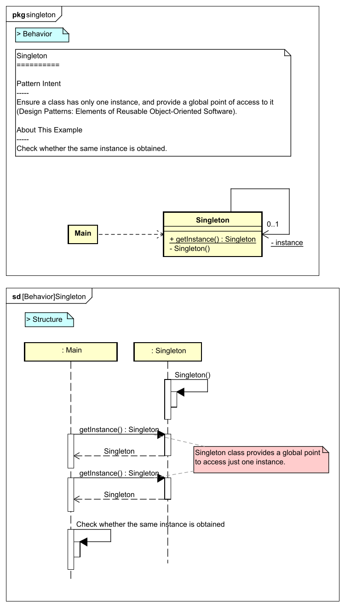</a> <a href="https://github.com/takaakit/design-pattern-examples-in-java/tree/master/src/main/java/creationalpatterns/singleton">Java Code</a> <a href="./creationalpatterns/singleton/execution_result.png">Execution Result</a> |  |

Structural Patterns
---
|  |  |  |
| :---: | :---: | :---: |
| **Adapter** | **Bridge** | **Composite** |
|  <a href="https://github.com/takaakit/design-pattern-examples-in-java/tree/master/src/main/java/structuralpatterns/adapter">Java Code</a> <a href="./structuralpatterns/adapter/execution_result.png">Execution Result</a> | <a href="https://takaakit.github.io/uml-diagram-for-java-design-pattern-examples/structuralpatterns/bridge/diagram_map.html">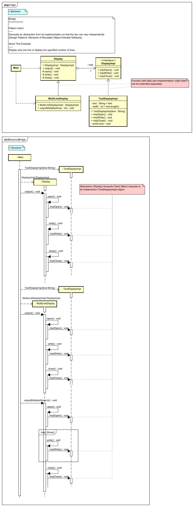</a> <a href="https://github.com/takaakit/design-pattern-examples-in-java/tree/master/src/main/java/structuralpatterns/bridge">Java Code</a> <a href="./structuralpatterns/bridge/execution_result.png">Execution Result</a> | <a href="https://takaakit.github.io/uml-diagram-for-java-design-pattern-examples/structuralpatterns/composite/diagram_map.html">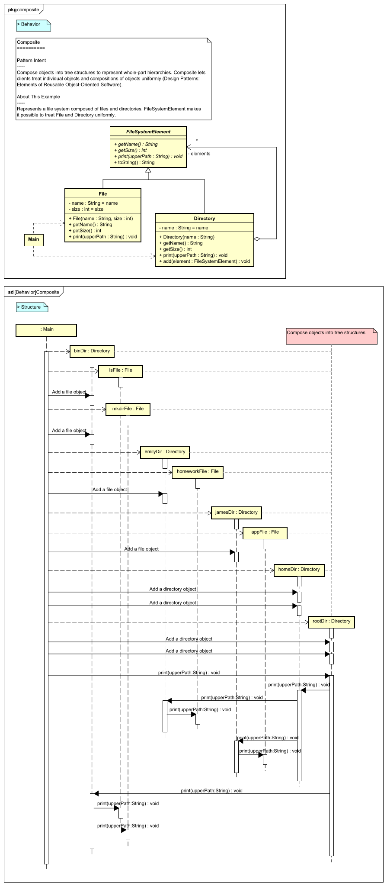</a> <a href="https://github.com/takaakit/design-pattern-examples-in-java/tree/master/src/main/java/structuralpatterns/composite">Java Code</a> <a href="./structuralpatterns/composite/execution_result.png">Execution Result</a> |
| **Decorator** | **Facade** | **Flyweight** |
|  <a href="https://github.com/takaakit/design-pattern-examples-in-java/tree/master/src/main/java/structuralpatterns/decorator">Java Code</a> <a href="./structuralpatterns/decorator/execution_result.png">Execution Result</a> | <a href="https://takaakit.github.io/uml-diagram-for-java-design-pattern-examples/structuralpatterns/facade/diagram_map.html">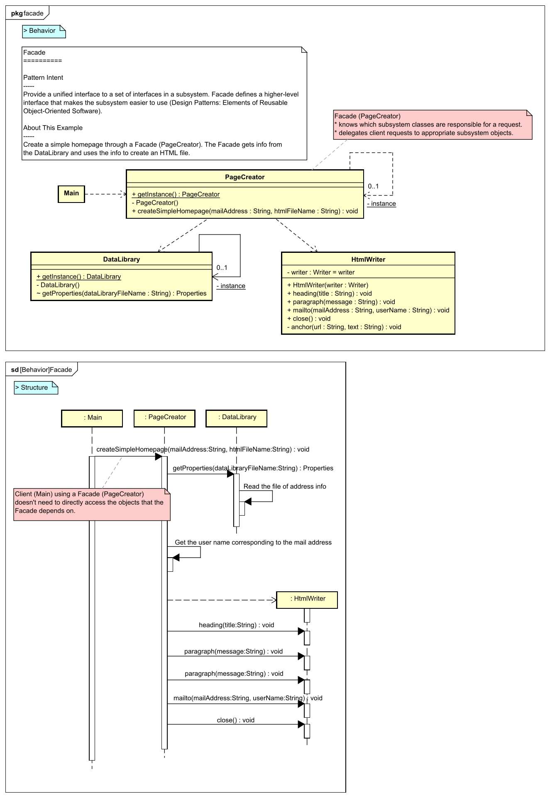</a> <a href="https://github.com/takaakit/design-pattern-examples-in-java/tree/master/src/main/java/structuralpatterns/facade">Java Code</a> <a href="./structuralpatterns/facade/execution_result.png">Execution Result</a> | <a href="https://takaakit.github.io/uml-diagram-for-java-design-pattern-examples/structuralpatterns/flyweight/diagram_map.html">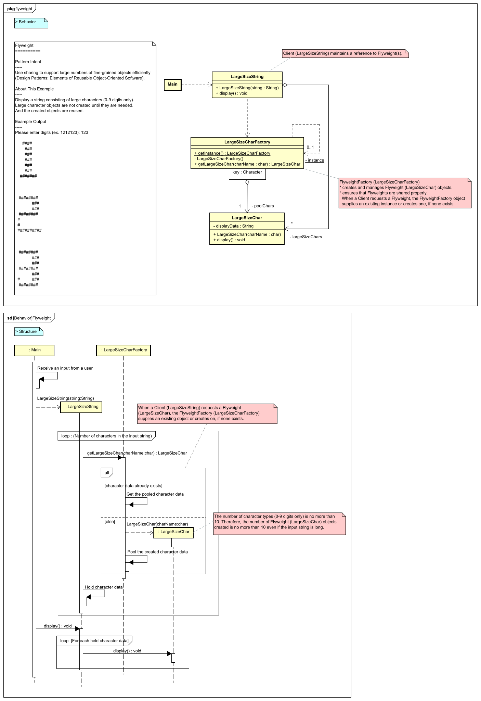</a> <a href="https://github.com/takaakit/design-pattern-examples-in-java/tree/master/src/main/java/structuralpatterns/flyweight">Java Code</a> <a href="./structuralpatterns/flyweight/execution_result.png">Execution Result</a> |
| **Proxy** |  |  |
| <a href="https://takaakit.github.io/uml-diagram-for-java-design-pattern-examples/structuralpatterns/proxy/diagram_map.html">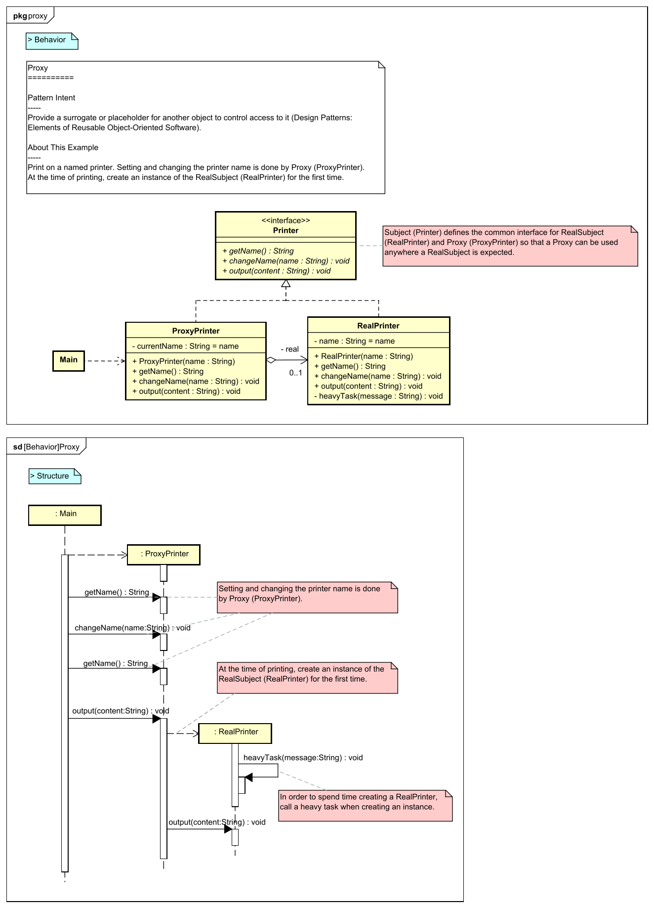</a> <a href="https://github.com/takaakit/design-pattern-examples-in-java/tree/master/src/main/java/structuralpatterns/proxy">Java Code</a> <a href="./structuralpatterns/proxy/execution_result.png">Execution Result</a> | | |

References
---
* Gamma, E. et al. Design Patterns: Elements of Reusable Object-Oriented Software, Addison-Wesley, 1994
* Hiroshi Yuki. Learning Design Patterns in Java [In Japanese Language], Softbank publishing, 2004

Links
---
* [Design Pattern Examples in Java](https://github.com/takaakit/design-pattern-examples-in-java)
* [Diagram Map: tracing UML elements across diagrams](https://dev.to/takaakit/diagram-map-tracing-uml-sysml-elements-across-diagrams-49i7)

License
---
Diagram Map file (diagram_map.html) includes the following libraries:
* [D3.js](https://d3js.org) is copyrighted by Mike Bostock and is released under the [BSD license](https://opensource.org/licenses/BSD-3-Clause).
* [Popper.js](https://popper.js.org) is copyrighted by Federico Zivolo and is released under the [MIT license](https://opensource.org/licenses/MIT).
* [Tippy.js](https://atomiks.github.io/tippyjs) is copyrighted by atomiks and is released under the [MIT license](https://opensource.org/licenses/MIT).
* [Chroma.js](https://gka.github.io/chroma.js) is copyrighted by Gregor Aisch and is released under the [BSD license](https://opensource.org/licenses/BSD-3-Clause).

Files and data in this project other than the above libraries are under the [Creative Commons Zero (CC0) license](https://creativecommons.org/publicdomain/zero/1.0/).

Other Language Examples
-----------------------
[C++](https://github.com/takaakit/uml-diagram-for-cpp-design-pattern-examples), [C#](https://github.com/takaakit/uml-diagram-for-csharp-design-pattern-examples), [Crystal](https://github.com/takaakit/uml-diagram-for-crystal-design-pattern-examples), [Go](https://github.com/takaakit/uml-diagram-for-golang-design-pattern-examples), [JavaScript](https://github.com/takaakit/uml-diagram-for-javascript-design-pattern-examples), [Kotlin](https://github.com/takaakit/uml-diagram-for-kotlin-design-pattern-examples), [Python](https://github.com/takaakit/uml-diagram-for-python-design-pattern-examples), [Ruby](https://github.com/takaakit/uml-diagram-for-ruby-design-pattern-examples), [Scala](https://github.com/takaakit/uml-diagram-for-scala-design-pattern-examples), [Swift](https://github.com/takaakit/uml-diagram-for-swift-design-pattern-examples), [TypeScript](https://github.com/takaakit/uml-diagram-for-typescript-design-pattern-examples)
