UML Diagram for Java Design Pattern Examples
===

This project lists UML diagrams of the "[Design Pattern Examples in Java](https://github.com/takaakit/design-pattern-examples-in-java)". When you click on a diagram image below, the diagram will be opened in <b>Diagram Map</b>. If you want to know about <b>Diagram Map</b>, please see the post below.  
[https://dev.to/takaakit/diagram-map-tracing-uml-sysml-elements-across-diagrams-49i7](https://dev.to/takaakit/diagram-map-tracing-uml-sysml-elements-across-diagrams-49i7)

Behavioral Patterns
---
|  |  |  |
| :---: | :---: | :---: |
| **Chain of Responsibility** | **Command** | **Interpreter** |
|  <a href="https://github.com/takaakit/design-pattern-examples-in-java/tree/master/src/main/java/behavioralpatterns/chainofresponsibility">Java Code</a> |  <a href="https://github.com/takaakit/design-pattern-examples-in-java/tree/master/src/main/java/behavioralpatterns/command">Java Code</a> | <a href="https://htmlpreview.github.io/?https://github.com/takaakit/uml-diagram-for-java-design-pattern-examples/blob/master/behavioralpatterns/interpreter/DiagramMap.html">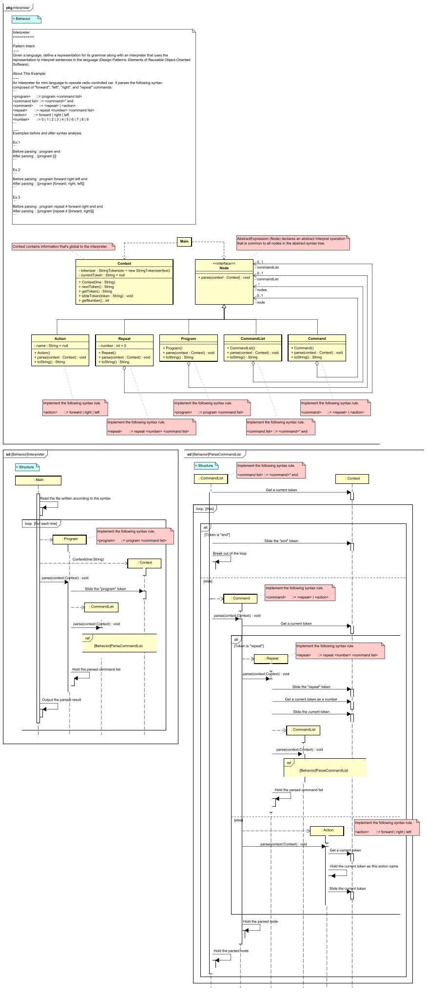</a> <a href="https://github.com/takaakit/design-pattern-examples-in-java/tree/master/src/main/java/behavioralpatterns/interpreter">Java Code</a> |
| **Iterator** | **Mediator** | **Memento** |
| <a href="https://htmlpreview.github.io/?https://github.com/takaakit/uml-diagram-for-java-design-pattern-examples/blob/master/behavioralpatterns/iterator/DiagramMap.html">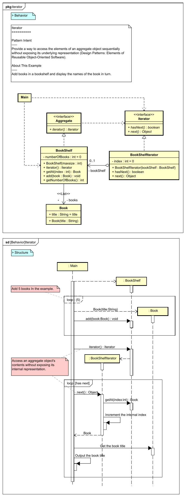</a> <a href="https://github.com/takaakit/design-pattern-examples-in-java/tree/master/src/main/java/behavioralpatterns/iterator">Java Code</a> | <a href="https://htmlpreview.github.io/?https://github.com/takaakit/uml-diagram-for-java-design-pattern-examples/blob/master/behavioralpatterns/mediator/DiagramMap.html">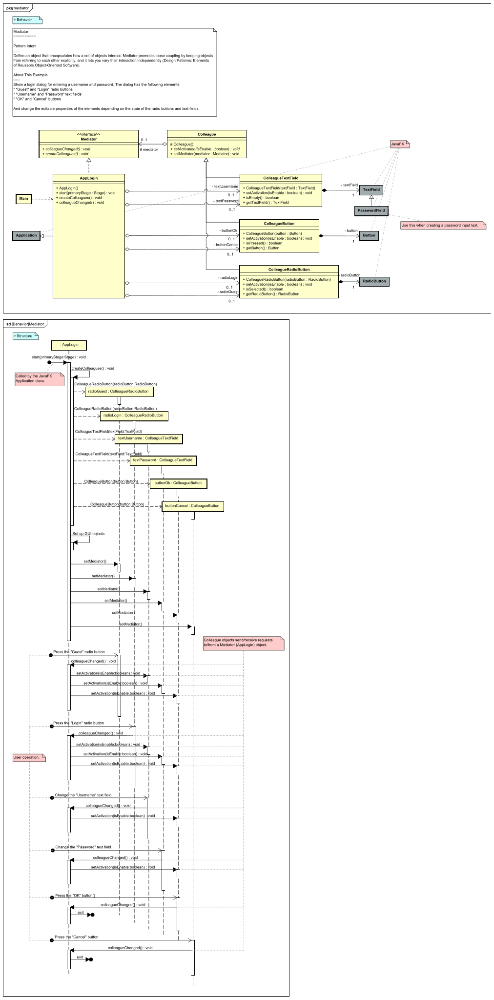</a> <a href="https://github.com/takaakit/design-pattern-examples-in-java/tree/master/src/main/java/behavioralpatterns/mediator">Java Code</a> |  <a href="https://github.com/takaakit/design-pattern-examples-in-java/tree/master/src/main/java/behavioralpatterns/memento">Java Code</a> |
| **Observer** | **State** | **Strategy** |
| <a href="https://htmlpreview.github.io/?https://github.com/takaakit/uml-diagram-for-java-design-pattern-examples/blob/master/behavioralpatterns/observer/DiagramMap.html">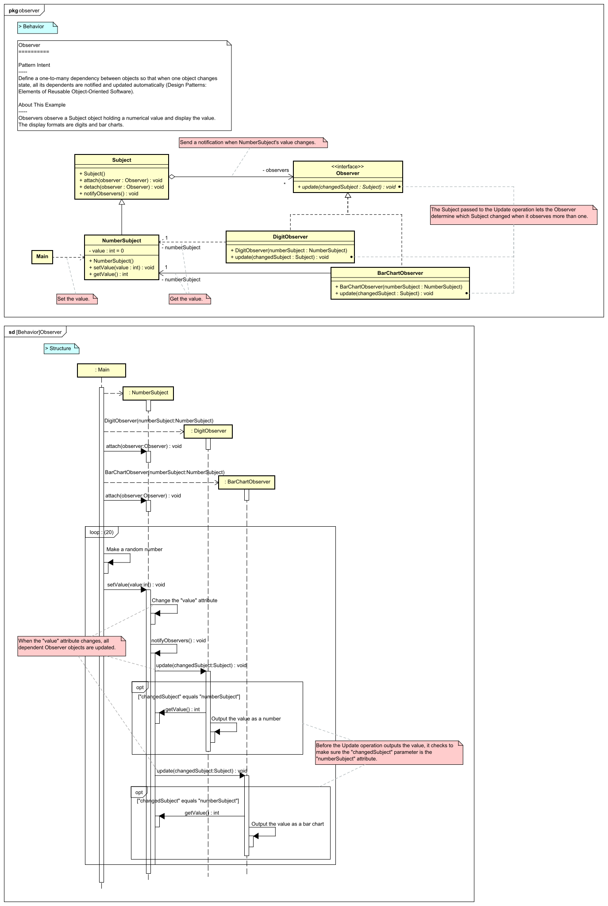</a> <a href="https://github.com/takaakit/design-pattern-examples-in-java/tree/master/src/main/java/behavioralpatterns/observer">Java Code</a> |  <a href="https://github.com/takaakit/design-pattern-examples-in-java/tree/master/src/main/java/behavioralpatterns/state">Java Code</a> |  <a href="https://github.com/takaakit/design-pattern-examples-in-java/tree/master/src/main/java/behavioralpatterns/strategy">Java Code</a> |
| **Template Method** | **Visitor** |  |
| <a href="https://htmlpreview.github.io/?https://github.com/takaakit/uml-diagram-for-java-design-pattern-examples/blob/master/behavioralpatterns/templatemethod/DiagramMap.html">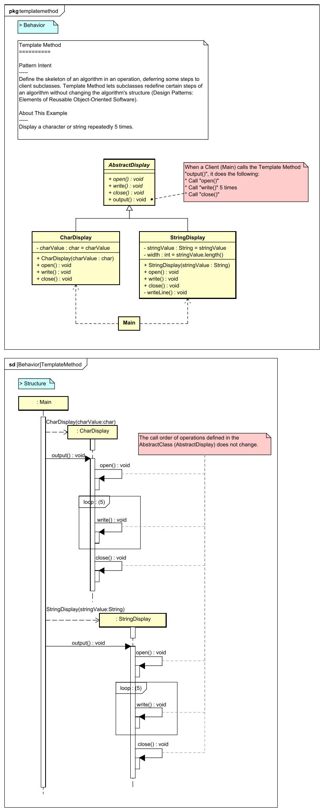</a> <a href="https://github.com/takaakit/design-pattern-examples-in-java/tree/master/src/main/java/behavioralpatterns/templatemethod">Java Code</a> | <a href="https://htmlpreview.github.io/?https://github.com/takaakit/uml-diagram-for-java-design-pattern-examples/blob/master/behavioralpatterns/visitor/DiagramMap.html">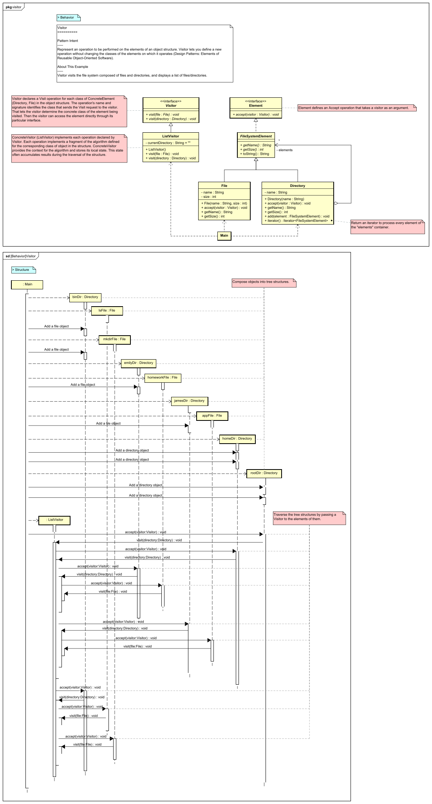</a> <a href="https://github.com/takaakit/design-pattern-examples-in-java/tree/master/src/main/java/behavioralpatterns/visitor">Java Code</a> |  |

Creational Patterns
---
|  |  |  |
| :---: | :---: | :---: |
| **Abstract Factory** | **Builder** | **Factory Method** |
|  <a href="https://github.com/takaakit/design-pattern-examples-in-java/tree/master/src/main/java/creationalpatterns/abstractfactory">Java Code</a> |  <a href="https://github.com/takaakit/design-pattern-examples-in-java/tree/master/src/main/java/creationalpatterns/builder">Java Code</a> | <a href="https://htmlpreview.github.io/?https://github.com/takaakit/uml-diagram-for-java-design-pattern-examples/blob/master/creationalpatterns/factorymethod/DiagramMap.html">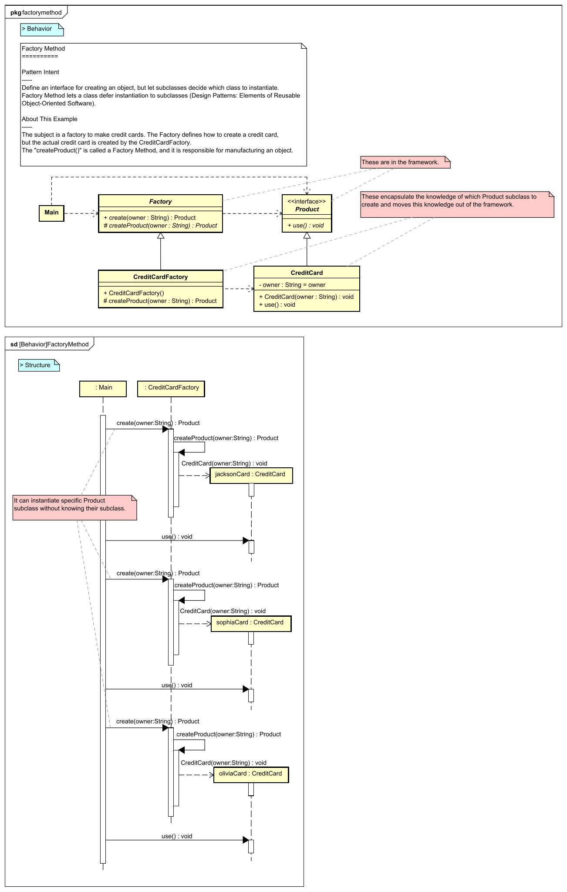</a> <a href="https://github.com/takaakit/design-pattern-examples-in-java/tree/master/src/main/java/creationalpatterns/factorymethod">Java Code</a> |
| **Prototype** | **Singleton** |  |
|  <a href="https://github.com/takaakit/design-pattern-examples-in-java/tree/master/src/main/java/creationalpatterns/prototype">Java Code</a> |  <a href="https://github.com/takaakit/design-pattern-examples-in-java/tree/master/src/main/java/creationalpatterns/singleton">Java Code</a> |  |

Structural Patterns
---
|  |  |  |
| :---: | :---: | :---: |
| **Adapter** | **Bridge** | **Composite** |
| <a href="https://htmlpreview.github.io/?https://github.com/takaakit/uml-diagram-for-java-design-pattern-examples/blob/master/structuralpatterns/adapter/DiagramMap.html">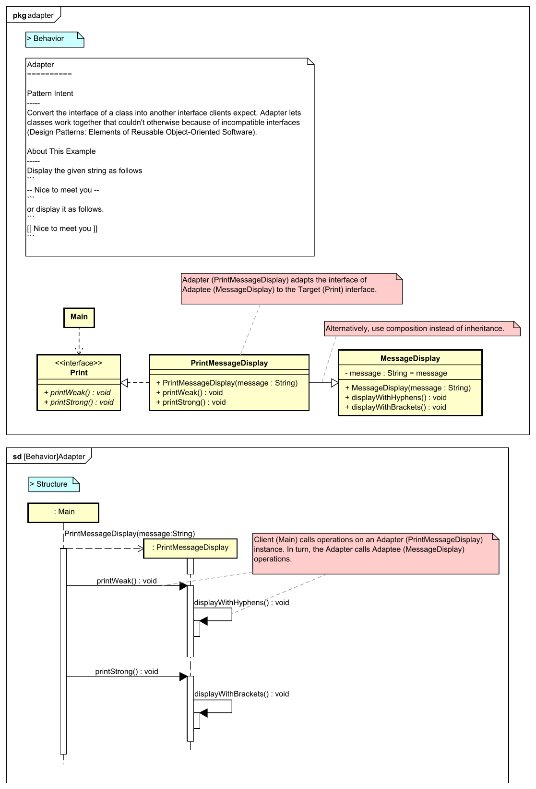</a> <a href="https://github.com/takaakit/design-pattern-examples-in-java/tree/master/src/main/java/structuralpatterns/adapter">Java Code</a> |  <a href="https://github.com/takaakit/design-pattern-examples-in-java/tree/master/src/main/java/structuralpatterns/bridge">Java Code</a> | <a href="https://htmlpreview.github.io/?https://github.com/takaakit/uml-diagram-for-java-design-pattern-examples/blob/master/structuralpatterns/composite/DiagramMap.html">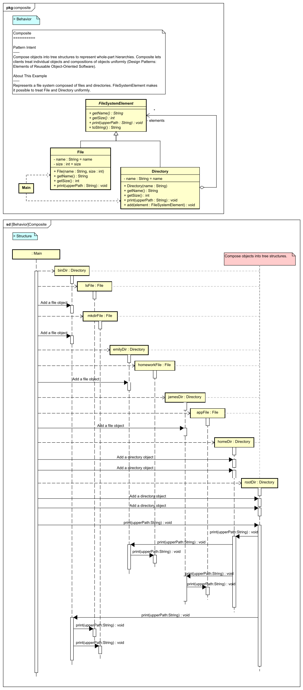</a> <a href="https://github.com/takaakit/design-pattern-examples-in-java/tree/master/src/main/java/structuralpatterns/composite">Java Code</a> |
| **Decorator** | **Facade** | **Flyweight** |
| <a href="https://htmlpreview.github.io/?https://github.com/takaakit/uml-diagram-for-java-design-pattern-examples/blob/master/structuralpatterns/decorator/DiagramMap.html">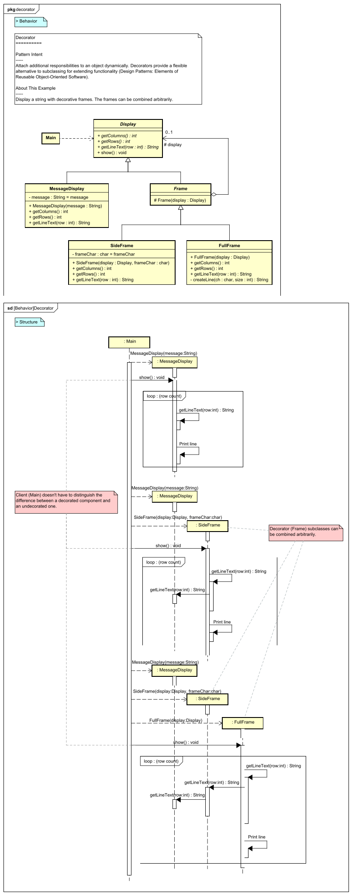</a> <a href="https://github.com/takaakit/design-pattern-examples-in-java/tree/master/src/main/java/structuralpatterns/decorator">Java Code</a> |  <a href="https://github.com/takaakit/design-pattern-examples-in-java/tree/master/src/main/java/structuralpatterns/facade">Java Code</a> | <a href="https://htmlpreview.github.io/?https://github.com/takaakit/uml-diagram-for-java-design-pattern-examples/blob/master/structuralpatterns/flyweight/DiagramMap.html">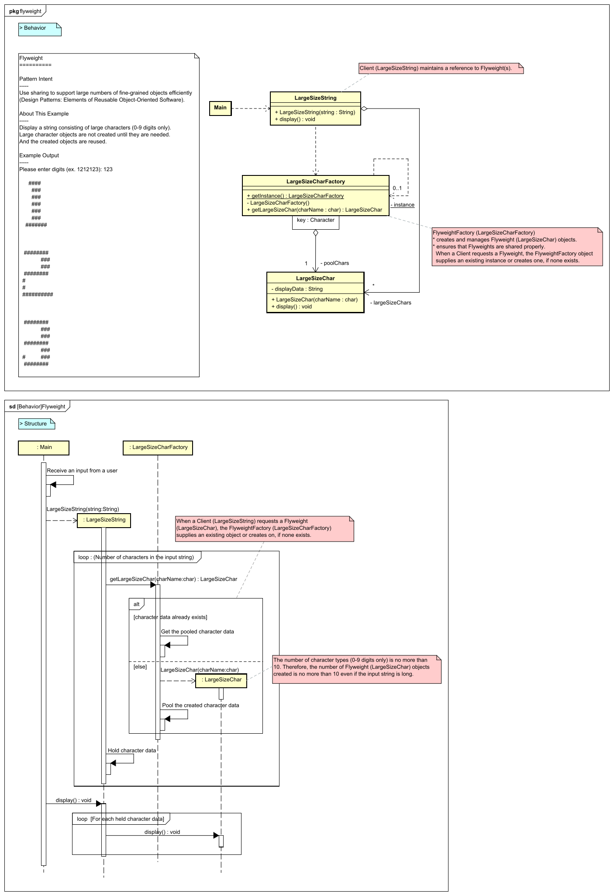</a> <a href="https://github.com/takaakit/design-pattern-examples-in-java/tree/master/src/main/java/structuralpatterns/flyweight">Java Code</a> |
| **Proxy** |  |  |
|  <a href="https://github.com/takaakit/design-pattern-examples-in-java/tree/master/src/main/java/structuralpatterns/proxy">Java Code</a> | | |

References
---
* Gamma, E. et al. Design Patterns: Elements of Reusable Object-Oriented Software, Addison-Wesley, 1994
* Hiroshi Yuki. Learning Design Patterns in Java [In Japanese Language], Softbank publishing, 2004

Links
---
* [Design Pattern Examples in Java](https://github.com/takaakit/design-pattern-examples-in-java)
* [Diagram Map: tracing UML/SysML elements across diagrams](https://dev.to/takaakit/diagram-map-tracing-uml-sysml-elements-across-diagrams-49i7)

Licence
---
Diagram Map file (DiagramMap.html) includes the following libraries:
* [D3 library](https://d3js.org) is copyrighted by Mike Bostock and is released under the [BSD license](https://opensource.org/licenses/BSD-3-Clause).
* [Popper library](https://popper.js.org/) is copyrighted by Federico Zivolo and is released under the [MIT license](https://opensource.org/licenses/MIT).
* [Tippy library](https://atomiks.github.io/tippyjs/) is copyrighted by atomiks and is released under the [MIT license](https://opensource.org/licenses/MIT).

Files and data in this project other than the above libraries are under the [Creative Commons Zero (CC0) license](https://creativecommons.org/publicdomain/zero/1.0/).
